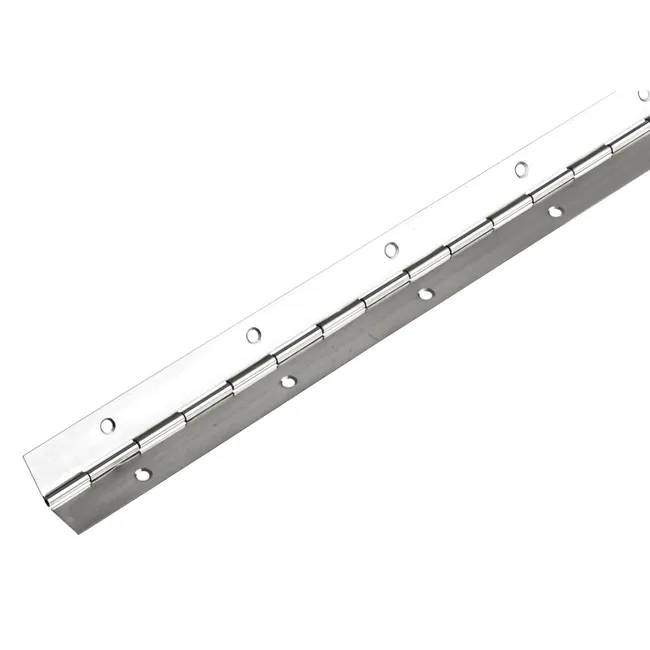
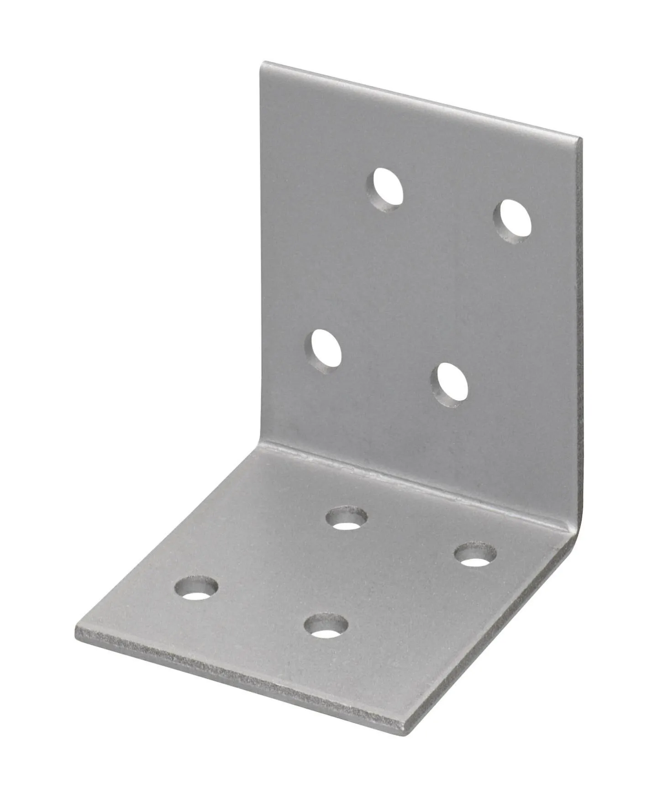
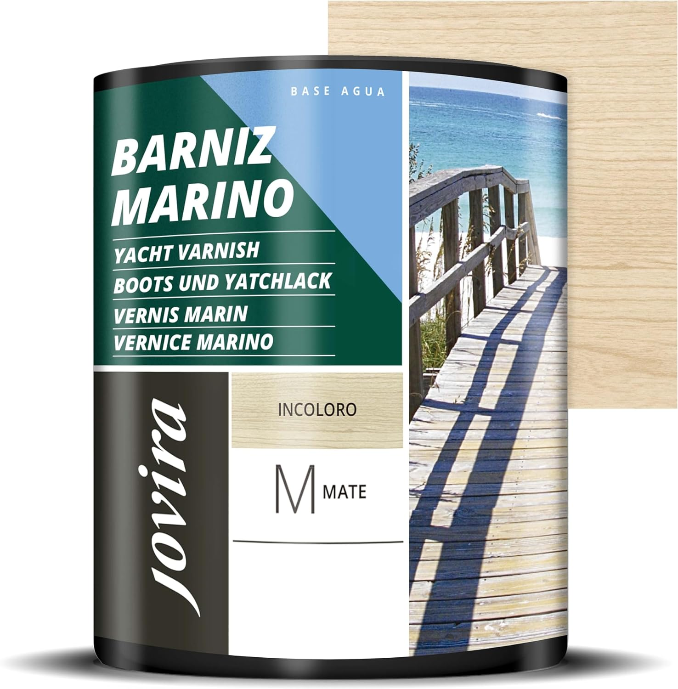

# Choix des différentes ressources

Pour réaliser notre mallette, nous avons étudier les différents matériaux possibles à sa fabrication.
Nous avons dû étudier les caractéristiques de chaque famille de matériaux ainsi que les différences entre les matériaux de même famille.

## Liste des familles de matériaux

| Plastiques    | Bois     |      Métaux     |
| :-----------: | :------: | :-------------: |
| Polypropylène | Peuplier | Aluminium       |
| Polyéthylène  | Bouleau  | Acier inoxydable|
| Polycarbonate | Okoumé   |                 |

Les matériaux retenus sont les suivants : le Polypropylène, le Peuplier ainsi que l'Aluminium.

### Caractéristiques de chaque matériau

|             | Polypropylène |  Peuplier |  Aluminium  |
| :---------: | :-----------: | :-------: | :---------: |
| Étanchéité  |       ✓       |     ✗     |      ✓      |
|    Poids    |   [946 kg/m3](https://blogue.polyalto.com/les-plastiques-sont-ils-legers#:~:text=Polypropylène%20%3A%20946%20kg%2Fm3)   | [410 kg/m3](https://www.leroymerlin.fr/produits/menuiserie/panneau-planche-et-materiaux-bois/panneau-bois-agglomere-mdf/panneau-bois-recoupable/panneau-contreplaque-peuplier-ep-6-mm-x-l-150-x-60-cm-82707653.html) | [2 700 kg/m3](https://blogue.polyalto.com/les-plastiques-sont-ils-legers#:~:text=Aluminium%20%3A%202700%20kg%2Fm3) |
| Sensibilité |  Chaleur / UV |  Humidité |   Rayures   |  
| Coût |  [68 €/m2](https://www.polydis.fr/pp-extrude-gris-7032-2000x1000-mm-c2x40088463) |  [33 €/m2](https://www.leroymerlin.fr/produits/menuiserie/panneau-planche-et-materiaux-bois/panneau-bois-agglomere-mdf/panneau-bois-recoupable/panneau-contreplaque-peuplier-ep-6-mm-x-l-150-x-60-cm-82707653.html) |   [530 €/m2](https://fr.rs-online.com/web/p/feuilles-metalliques/7781661?cm_mmc=FR-PLA-DS3A-_-google-_-CSS_FR_FR_ePMax_Low-_--_-7781661&matchtype=&&gad_source=1&gclid=CjwKCAjwkuqvBhAQEiwA65XxQPn9M6ERE-UFnZ-qpu5_QKVQ-W7J1bDxwgeYIAuFi_Us82aQZu0H2hoC0rUQAvD_BwE&gclsrc=aw.ds) |

## Choix final

Le matériau que l'on va utiliser pour réaliser notre malette est le **peuplier**, on va utiliser des plaques en contreplaqué de 5mm.

---

## Choix des systèmes d'accroche

### Les profilés

Les profilés seront utilisés pour créer un renfort de poids pour le socle de la boîte, cela évitera de devoir doubler l'épaisseur de la boîte pour pouvoir supporter tout le poids qui sera contenu dans la boîte.

### Les sauterelles

Nous utiliserons ce type de sauterelles pour fermer notre mallette. Simple et robuste, ce système permet une ouverture/fermeture rapide, de plus elles sont bloquantes.
Elles serviront à maintenir le capot de la mallette avec le socle qui sont amovibles.

### La charnière

Nous utiliserons une charnière piano sur la longueur du socle, ce qui permettra aux deux parties qui le compose de pouvoir se déplier et se transformer en zone de travail.
De plus, elle offrira un renfort au niveau de l'arête pour les futures manipulations et transport de la mallette.

### Les équerres

Les équerres seront utilisées pour la fabrication du capot de la mallette.
Elles permettront de renforcer les angles et d'assembler proprement les différentes plaques de contreplaqué ensemble.

### Colle & Vis

Pour fixer les plaques de bois entre elles, nous avons décidé d'utilisé de la colle.
C'est facile d'utilisation et c'est résistant.
Ensuite pour les différents accesoires précédemment cités, nous allons devoir les visser et pour ce faire, nous allons des vis M3.
Nous utiliserons aussi des vis M3 pour la fixation des différents accessoires pour les modules du Cobot.

---

## Le Vernis

Le vernis que nous utiliserons est un vernis marin.
Ce vernis à la particularité de rendre le bois étanche ce qui permettra de protéger la mallette des intempéries.

